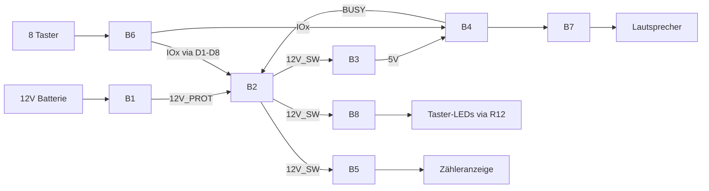

# Digitaler Zwilling — Vogelstimmenkasten Rev 3.0

**Stand:** 11. August 2026  
**Ebenen:** System → Block (B1–B8) → Bauteil  
**PCB:** `hardware/V3.0/vogelstimmen_v3.0.kicad_pcb`  
**Simulation:** `simulation/` (HTML, `js/parts.js` + `js/model.js`)  
**ADRs:** Latch/Audio/Buck/USB in `docs/entscheidungen.md`; Zähler E-CNT-02…04 in `hardware/V3.0/docs/entscheidungen_v30.md`

---

## 1. Systemebene



| Rail | Wann aktiv | Verbraucher |
|------|------------|-------------|
| BAT+ | immer (Batterie) | nur Q5 |
| 12V_PROT | bei richtiger Polung | Latch-Logik, TVS, C1 |
| 12V_SW | nur Latch AN | Buck, R4, LEDs, **B5 One-Shot/Hengstler** |
| **12V_LED** | nur Latch AN | R12 → J6 → 8× Taster-LEDs |
| 5V | nur Latch AN | DY-SV17F (nicht der Zähler) |
| CNT_LO | nur ~80 ms nach Latch-ON | Drain Q7 / Spulen− |
| GND | immer | alles |

**Ruhestrom Ziel:** Latch AUS → ≈0 µA (E-LATCH-01/02). `12V_SW` tot → Hengstler-Spule 0 mA.

---

## 2. Blockebene (Kurz)

| Block | Aufgabe | Kritische Bauteile |
|-------|---------|-------------------|
| B1 | Verpolung, Überstrom, Transient | Q5, D11, R6, R7, F1, D9, C1 |
| B2 | Ein/Aus, Hold, Release | Q1, D12, R1, R8, Q2, Q3, R13, C4, D1–D8, R2–R4 |
| B3 | 12V→5V | U1, L1, C2, C3, R5=0R |
| B4 | Audio | U2 DY-SV17F, D15–D22 |
| **B5** | **Session zählen (One-Shot)** | **J5 Hengstler 0.635.128, C20, R20, R21, D23, Q7, D10** |
| B6 | Taster | J3, J4 |
| B7 | Lautsprecher | J2 |
| B8 | LEDs | J6, R12 |

---

## 3. B5 — One-Shot für den Hengstler (Kern Rev 3.0)

**Warum diese Baugruppe?**  
`12V_SW` bleibt Minuten an (ganze Session). Der Hengstler braucht nur einen kurzen Spulenimpuls (≥50 ms laut Datenblatt). Dauerstrom an der Spule würde ~6,5 mA die ganze Session ziehen und unnötig Energie verbrauchen. Die One-Shot-Baugruppe erzeugt **genau einen ~80 ms-Impuls pro Latch-ON** → **+1 Count**, danach Spule aus.

```
12V_SW ──┬── C20 (1µF) ── CNT_PULSE ── R21 (100Ω) ── Q7.G
         │                    │
         │                   R20 (100k) → GND
         │                    │
         │                   D23 Clamp → GND
         │
         ├── J5+ (Spulen+)
         │
         └── D10.K
                │
CNT_LO ─────────┼── J5− (Spulen−) ── Q7.D
         D10.A ─┘                    Q7.S → GND
```

| Ref | Was es für den Hengstler tut |
|-----|------------------------------|
| **C20** | Wandelt die Rising-Edge von `12V_SW` in einen kurzen Puls auf `CNT_PULSE` um (DC kommt nicht durch). |
| **R20** | Entlädt `CNT_PULSE` nach GND; bestimmt mit C20 die Pulsbreite (~R·C ≈ 100 ms, effektiv ~80 ms). Ruhe: Gate-Netz = 0 V. |
| **R21** | Serie zum AO3400-Gate: begrenzt Gate-Stromspitzen, dämpft Ringing. |
| **D23** | Clamp: verhindert, dass C20 beim Abfall von `12V_SW` den Gate-Knoten unter GND zieht. |
| **Q7** | Low-Side-Schalter: während des Pulses zieht er `CNT_LO` (Spulen−) nach GND → Spulenstrom fließt. Danach sperrt er. |
| **D10** | Freilauf parallel zur Spule: nimmt Induktionsstrom auf, wenn Q7 abschaltet. |
| **J5** | Hengstler **0.635.128** (Typ 635.1, 12 V, 6 Stellen, 1860 Ω ≈80 mW). 4 Lötpins 15,24×25,4 mm. |

**Simulationsphase:** `cnt_pulse` — Spulenstrom ≈ `12V_SW / 1860 Ω` ≈ 6,5 mA für `SYS.cnt_oneshot_s` = 80 ms.

**Verworfen:** 5 V-Zähler an Buck-Ausgang (Soft-Start-Race, E-CNT-04); Kübler K07 (nicht beschaffbar, E-CNT-02).

---

## 4. Bauteilebene (übrige Blöcke — Kurz)

### B1 — Eingangsschutz
Q5 SI2301 + D11 VGS-Clamp, R7/R6, F1 PTC 24 V, D9 SMAJ15A, C1.

### B2 — Latch
Q1 High-Side + D12; Q2 Hold; Q3 Release über R13/C4 (~470 ms Blanking); Q6 Kaltstart; D1–D8 OR; D15–D22 Modulschutz.

### B3 — Buck
U1 TPS62163 wandelt `12V_SW` nach **5 V nur für B4 (DY-SV17F)**. U1 erzeugt **keine** Zählerversorgung — weder 5 V noch 12 V für J5. Der Hengstler liegt an `12V_SW` (Latch Q1) plus One-Shot B5.

### B4 — Audio
U2 DY-SV17F: Idle 14 mA, Play ≤60 mA (+ SPK).

### B6–B8
J3/J4 Taster, J2 SPK BTL, J6 LEDs via R12.

---

## 5. Traceability (Zähler)

| ID | Aussage | Bauteile |
|----|---------|----------|
| E-CNT-03 | One-Shot ~80 ms pro Latch-ON | C20, R20, R21, D23, Q7 |
| E-CNT-04 | Hengstler 12 V PCB | J5 0.635.128, D10 |
| F10 / SF-07 | Sessions zählen, Idle 0 | B5 gesamt |
| H01 | Printzähler auf PCB | Footprint `CNT_HENGSTLER_635` |
| H06 | Anzeige von oben ablesbar | Gehäuse-Sichtfenster |

---

## 6. Simulation starten

Die Platinenansicht nutzt den **JLCPCB-Topview** (`simulation/assets/topview.png`). Handteile liegen als Fotos auf den Footprints (Hengstler J5, DY-SV17F U2, Phoenix-Klemmen). Rahmen folgen den echten Footprint-Maßen. Stromlinien folgen `pcb_tracks.json` — **gepunktet** auf der Unterseite (B.Cu) oder unter Modul/Zähler/Klemmen.

```bash
simulation/start_rev30.bat
```

Layout/Tracks aus V3.0 neu exportieren nach PCB-Änderungen:

```bash
& "C:\Program Files\KiCad\10.0\bin\python.exe" simulation/tools/export_layout.py
& "C:\Program Files\KiCad\10.0\bin\python.exe" simulation/tools/export_tracks.py
```
