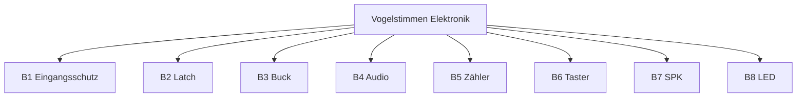

# MBSE / SysML-Sicht (Mermaid) — Rev 3.0

**Werkzeug:** Kein Cameo/Capella — SysML-Semantik als Markdown/Mermaid (Digital Thread light).

---

## 1. Requirement Diagram (Konzept)

```
F02 Taster→Stimme ──satisfy──> SF-04 Abspielen
E02 Idle <100µA ──satisfy──> SF-11 Ruhestrom
E02 ──derive──> E-LATCH-01
F-01 Review ──refine──> SYS-05 Domain-Trennung
```

Vollständige Tabellen: `traceability.md`, `anforderungen.md`.

---

## 2. BDD — Blöcke

Siehe `systemarchitektur.md` §2 (B1–B8).



---

## 3. IBD — Hauptflüsse

```
BAT → B1 → 12V_PROT → B2 → 12V_SW → B3 → 5V → B4 (nur Audio)
12V_SW → B5 One-Shot + Hengstler (12 V, nicht U1)
12V_SW → B8 → LEDs
Taster → B6 → IOx / BTN_OR → B2,B4
B4 BUSY → B2 Release
B4 → B7 SPK
```

---

## 4. Use Case Diagram

Akteure & UC: `use_cases.md`.

---

## 5. State Machine (Versorgung)

```
Idle (Latch aus, ~12µA)
  --Taste--> SetPulse
  -- > PowerUp/Boot
  --Flanke--> Playing
  --BUSY+RC--> Release
  --> Idle
```

Simuliert in `simulation/`.

---

## 6. Sequence / Activity

`use_cases.md` §5–6.

---

## 7. Parametric (Energie — Analyse)

| Parameter | Wert | Quelle |
|-----------|------|--------|
| Idle | ≈12 µA | E-RPP-01 / Sim |
| Ziel E02 | <100 µA | Lastenheft |
| Batterie | ~30 Ah (Annahme) | E03 Analyse in traceability |
| Play-Strom | Modul ≤60 mA + SPK + LED | parts.js / Spec |

Kein vollständiges Parametric Diagram Tool — Rechnung dokumentiert.

---

## 8. Digital Twin

Dokumentebene: `digitaler_zwilling.md`  
Verhaltens-Twin: `simulation/` (DC-Arbeitspunkte + Phasen, kein SPICE).
