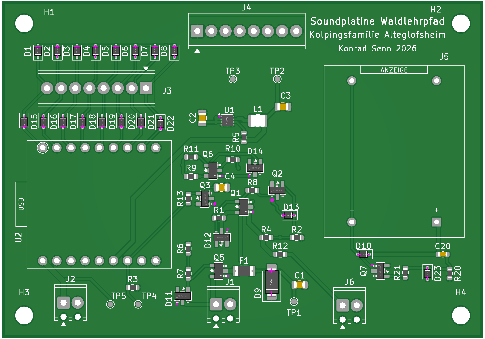

# Platine Rev 3.0 — Topview und BOM

Stand: **13. August 2026**. Dateien aus dem JLCPCB-Bestellvorgang (Downloads) in die Doku übernommen.

## Topview

JLCPCB-Bestückungsvorschau (Oberseite, SMD bereits platziert; Handteile als Footprints leer).

- Original: `docs/assets/topview_v3.0.png`
- Kopie Hardware-Paket: `hardware/V3.0/docs/topview_v3.0.png`
- Simulation nutzt dieselbe Datei: `simulation/assets/topview.png`

**Handbestückung auf diesem Bild noch leer:** U2 (DY-SV17F), J5 (Hengstler), J1/J2/J6 (MPT 2-pol), J3/J4 (MPT 8-pol). In der [Simulation](../simulation/index.html) liegen Fotos dieser Teile auf den Footprints.

## BOM (JLCPCB-Export)

Rohdatei aus Downloads: [`assets/bom_jlcpcb.xls`](assets/bom_jlcpcb.xls) · CSV: [`assets/bom_jlcpcb.csv`](assets/bom_jlcpcb.csv) · Tabelle: [`bom_jlcpcb.md`](bom_jlcpcb.md)

Stimmt mit `hardware/V3.0/JLCPCB_BOM.csv` überein (52 SMT, inkl. C20 = C15849 1 µF/50 V 0603, R21 = C22775 100 Ω 0603).

Handteile: `hardware/V3.0/HAND_BESTUECKUNG.csv`.

## Fotos der Handteile

| Teil | Datei |
|------|--------|
| Hengstler 0.635.128 | [`assets/parts/hengstler_0635128_top.png`](assets/parts/hengstler_0635128_top.png) |
| DY-SV17F | [`assets/parts/dysv17f_top.png`](assets/parts/dysv17f_top.png) |
| Phoenix MPT 2-pol | [`assets/parts/phoenix_mpt_2_top.png`](assets/parts/phoenix_mpt_2_top.png) |
| Phoenix MPT 8-pol | [`assets/parts/phoenix_mpt_8_top.png`](assets/parts/phoenix_mpt_8_top.png) |

Datenblätter zu allen Positionen: [`datasheets/README.md`](datasheets/README.md).
