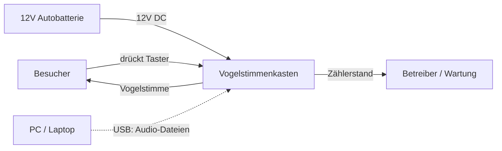
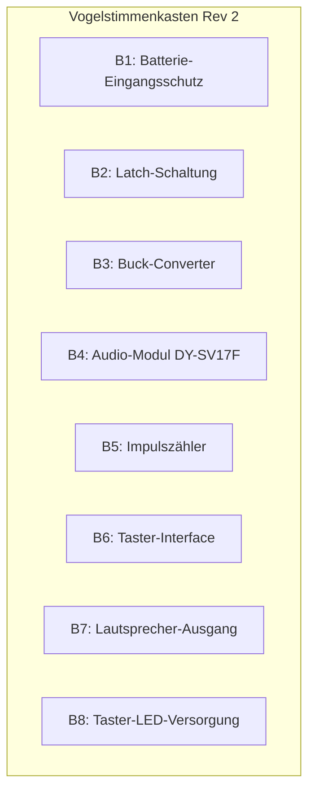
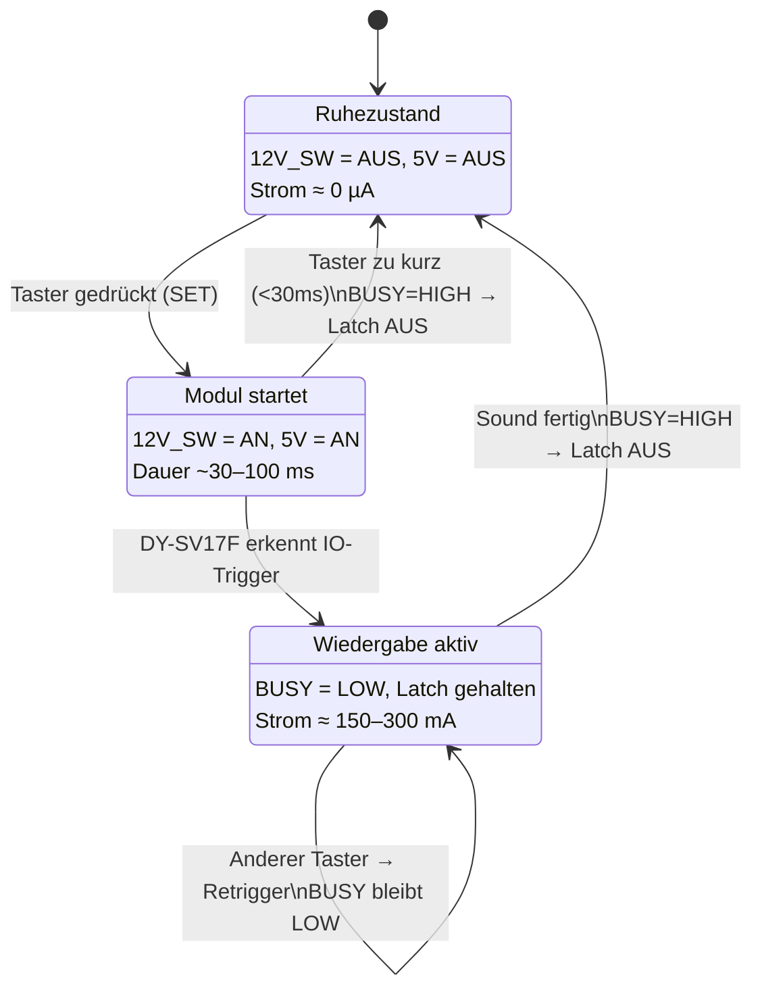

# Systemarchitektur: Vogelstimmenkasten Rev 2

**Datum:** 28. Juli 2026
**Basis:** Lastenheft Rev 2 (`docs/anforderungen.md`)

---

## 1. Systemkontext



**Systemgrenze:** Die Platine mit allen elektronischen Komponenten. Gehäuse, Taster, Lautsprecher und Batterie sind externe Bestandskomponenten.

---

## 2. Blockdefinitionsdiagramm (BDD)



### Blockbeschreibungen

| Block | Komponente | Funktion | Req-Trace |
|-------|-----------|----------|-----------|
| B1 | SMAJ15A + SI2301 **+ BZX84C6V2 (D11)** | Verpolung, TVS, **VGS-Clamp** | E01, SF-10, H07 |
| B2 | MOSFETs + Dioden-OR + **D12/R8** | Ein/Aus, Hold, Release, **VGS-Clamp Q1** | E02, E04, E05, H07 |
| B3 | TPS62163 | 12V → 5V, EN=12V_SW (kein UVLO-Teiler) | E01, E03 |
| B4 | DY-SV17F Modul | Audio-Wiedergabe, 8 IO-Trigger, integrierter 5W Verstärker | F01–F09, E06 |
| B5 | Hengstler 0.635.128 + One-Shot | Zählt Sessions: Rising-Edge 12V_SW → ~80 ms Spulenimpuls | F10, H01, E-CNT-03/04 |
| B6 | 2× MPT 0,5/8 + Dioden-OR + **Serie-Dioden D15–D22** | Taster → IOx; U2 ← IOx_M | F01, F02 |
| B7 | MPT 0,5/2 | SPK+/SPK- vom DY-SV17F zum Lautsprecher | F05, F09 |
| B8 | MPT 0,5/2 | 12V_SW für alle Taster-LEDs gemeinsam | F11 |

---

## 3. Internes Blockdiagramm (IBD)

```
┌─────────────────────────────────────────────────────────────────────────────┐
│  PLATINE                                                                    │
│                                                                             │
│  ┌──────────────────────┐                                                   │
│  │ B1: Eingangsschutz   │                                                   │
│  │                      │                                                   │
│  │  BAT+ ──[Q5+D11]──[PTC]──[TVS]──→ 12V_PROT                              │
│  │         VGS-Clamp                                                      │
│  │  BAT- ──────────────────→ GND                                            │
│  └──────────┬───────────┘                                                   │
│             │ 12V_PROT (immer verfügbar wenn Batterie angeschlossen)        │
│             │                                                               │
│  ┌──────────▼───────────┐         ┌────────────────────┐                    │
│  │ B2: Latch-Schaltung  │         │ B3: Buck-Converter │                    │
│  │                      │         │                    │                    │
│  │  SET ←── Taster-OR ──┼── ← ───┤                    │                    │
│  │  HOLD ←── BUSY_INV   │  12V_SW│  VIN ← 12V_SW     │                    │
│  │  OUT ─────────────────┼──→─────┤  EN ← UVLO-Teiler │                    │
│  │                       │        │  VOUT → 5V         │                    │
│  └───────────┬───────────┘        └────────┬───────────┘                    │
│              │ 12V_SW                      │ 5V                             │
│              │ (nur bei Wiedergabe)         │ (nur bei Wiedergabe)           │
│              │                             │                                │
│   ┌──────────▼──────┐          ┌───────────▼──────────────┐                 │
│   │ B8: LED-Versorg.│          │ B4: DY-SV17F Audio-Modul │                 │
│   │                 │          │                          │                 │
│   │ 12V_SW → LED+   │          │  VCC ← 5V               │                 │
│   │ GND → LED-       │          │  IO1–IO8 ← Taster       │                 │
│   └─────────────────┘          │  BUSY → B2 (HOLD)       │                 │
│                                │  BUSY → B5 (Zähler)     │                 │
│   ┌─────────────────┐          │  SPK+/SPK- → B7         │                 │
│   │ B6: Taster-IF   │          │  USB ← extern (Wartung) │                 │
│   │                 │          └──────────────────────────┘                 │
│   │ 8× Taster ─────┼──→ IO1–IO8 (DY-SV17F)                                │
│   │         └───────┼──→ Dioden-OR → SET (B2)                              │
│   └─────────────────┘                                                      │
│                                                                             │
│   ┌─────────────────┐          ┌─────────────────┐                          │
│   │ B5: Impulszähler│          │ B7: Lautsprecher│                          │
│   │                 │          │                 │                          │
│   │  VCC ← 5V      │          │  SPK+/SPK- ← B4│                          │
│   │  CLK ← BUSY    │          └─────────────────┘                          │
│   │  (über 2N7002)  │                                                       │
│   └─────────────────┘                                                       │
│                                                                             │
│   [TP1: 12V_PROT] [TP2: 5V] [TP3: GND] [TP4: BUSY] [TP5: Audio]          │
└─────────────────────────────────────────────────────────────────────────────┘
```

---

## 4. Spannungsebenen

| Rail | Quelle | Spannung | Aktiv | Verbraucher |
|------|--------|----------|-------|-------------|
| BAT+ | Autobatterie | 10,5–14,4 V | immer | B1 Eingangsschutz |
| 12V_PROT | nach P-FET + TVS | ~BAT+ minus 0,1V | immer | B2 Latch, UVLO-Teiler |
| 12V_SW | nach Latch P-FET | ~12V_PROT minus 0,1V | nur bei Wiedergabe | B3 Buck VIN, B8 LEDs |
| 5V | Buck-Ausgang | 5,0 V ± 2% | nur bei Wiedergabe | B4 DY-SV17F, B5 Zähler |

**Ruhezustand:** Nur 12V_PROT liegt an. Kein Strom fließt (Latch offen, Buck stromlos).
**Ruhestrom-Budget:** < 1 µA (nur Leckströme der MOSFETs und TVS-Diode). Anforderung E02 (< 100 µA) weit unterschritten.

---

## 5. Zustandsdiagramm



---

## 6. Signalfluss & Timing

### Normaler Ablauf (Tastendruck → Wiedergabe → Abschaltung)

| Zeit | Ereignis | Signale |
|------|----------|---------|
| t=0 | Taster gedrückt | IO_n = LOW, Dioden-OR → SET |
| t=0 | Latch schaltet ein | 12V_SW = 12V, Buck startet |
| t ≈ 5 ms | Buck-Ausgang stabil | 5V = 5,0V |
| t ≈ 30–100 ms | DY-SV17F Boot abgeschlossen | IO-Pins werden gelesen |
| t ≈ 30–100 ms | IO_n = LOW erkannt → Wiedergabe startet | BUSY = LOW → Latch HOLD |
| t ≈ 0…80 ms | Latch ON → One-Shot | Q7 leitet → Hengstler +1; danach Spule aus |
| t ≈ 100–300 ms | Taster losgelassen | IO_n = HIGH (kein Effekt, Mode 0) |
| t ≈ 10 s | Sound fertig | BUSY = HIGH |
| t ≈ 10 s + 1 ms | Latch öffnet | 12V_SW = 0V, 5V = 0V |
| t ≈ 10 s + 50 ms | System stromlos | IDLE |

### Retrigger (Tastenwechsel während Wiedergabe)

| Zeit | Ereignis | Signale |
|------|----------|---------|
| t=5 s | Sound 1 läuft | BUSY = LOW |
| t=5 s | Taster 3 gedrückt | IO3 = LOW → Flanke → Mode 0 Retrigger |
| t=5 s | Sound 1 stoppt, Sound 3 startet | BUSY bleibt LOW |
| t ≈ 15 s | Sound 3 fertig | BUSY = HIGH → Latch AUS |

### Kurzer Tastendruck (< 30 ms)

| Zeit | Ereignis | Signale |
|------|----------|---------|
| t=0 | Taster gedrückt | Latch AN |
| t=20 ms | Taster losgelassen | IO_n = HIGH |
| t ≈ 50 ms | DY-SV17F Boot fertig | Kein IO LOW → kein Trigger |
| t ≈ 50 ms | BUSY = HIGH (nichts spielt) | Latch AUS → IDLE |

**Designentscheidung:** Kein RC-Verzögerungsglied. Kurzer Druck = kein Sound = kein Problem. Bewusst akzeptiert (siehe Zwischenstand).

---

## 7. Latch-Schaltung — Funktionsprinzip

```
         12V_PROT
            │
        ┌───┴───┐
        │ Q1    │  P-MOSFET (Leistungsschalter)
        │ (P)   │
        └───┬───┘
            │ Gate ←─── R_pullup ──── 12V_PROT
            │              │
            │          ┌───┴───┐
            │          │ Q2    │  N-MOSFET (Latch-Logik)
            │          │ (N)   │
            │          └───┬───┘
            │              │ Gate
            │              │
      12V_SW              ┌┴┐
       │                  │ │  R_gate
       ├→ Buck VIN        └┬┘
       ├→ LED+             │
       │              ┌────┴─────┐
       │              │          │
       │         Dioden-OR    BUSY_INV
       │         (8 Taster)   (über R/FET)
       │              │          │
       │           SET          HOLD
```

**SET:** Beliebiger Taster zieht über Dioden-OR das Gate von Q2 HIGH → Q2 leitet → Q1-Gate auf GND → Q1 leitet → 12V_SW = AN.

**HOLD:** Sobald DY-SV17F spielt, ist BUSY = LOW (3,3V-Logik). Invertiert ergibt das HIGH → Q2 bleibt leitend → Latch bleibt an, auch nach Loslassen des Tasters.

**RELEASE:** Sound fertig → BUSY = HIGH → invertiert = LOW → Q2 sperrt → Q1 sperrt → 12V_SW = AUS.

**Pull-Down am BUSY-Pin:** 10kΩ nach GND hält BUSY definiert LOW während der Boot-Phase, verhindert versehentliches Latch-Release beim Hochfahren.

---

## 8. Taster-Verdrahtung

Jeder Taster hat 5 Anschlüsse (19mm Edelstahl mit LED-Ring):

```
Taster N (N = 1..8)
├── Pin 1 (NO)  ────→ IO_N am DY-SV17F (+ Pull-up 10kΩ auf 5V intern)
├── Pin 2 (COM) ────→ GND
├── Pin 3 (LED+) ───→ 12V_SW (alle 8 gemeinsam)
├── Pin 4 (LED-) ───→ GND
└── Pin 1 (NO)  ────→ Diode → Latch SET (alle 8 über Dioden-OR)
```

**Schraubklemmen auf PCB (E-CONN-01, Phoenix MPT 0,5):**
- J3: 8-pol IO0–IO7 → DY-SV17F + Dioden-OR
- J4: 8-pol GND (eine Ader GND pro Taster)
- J6: 2-pol 12V_SW + GND für LEDs
- J2: 2-pol SPK+/SPK−; J1: 2-pol Batterie

Details: `docs/schaltplan.md`, `docs/entscheidungen.md` → E-CONN-01.

---

## 9. Designentscheidungen — Zusammenfassung

| # | Entscheidung | Begründung | Alternative verworfen |
|---|-------------|------------|----------------------|
| D1 | DY-SV17F statt WT588D | 8 IO-Trigger, USB Drag&Drop, Amp integriert, verfügbar | WT588D (abgekündigt), Adafruit FX (35mA idle) |
| D2 | Hardware-Latch statt Sleep | 0 µA Ruhestrom, kein Firmware nötig | Software-Sleep (DY-SV17F hat keinen im IO-Modus) |
| D3 | Mode 0 (Flanke) statt Mode 1 (Pegel) | Sound spielt nach kurzem Druck komplett durch | Mode 1 (Taster müsste 10s gehalten werden) |
| D4 | Kein RC-Verzögerungsglied | Kurzer Druck (<30ms) = kein Sound = akzeptabel | Soft-Start, ATtiny85, 74HC125-Buffer |
| D5 | 5V einzige Spannungsebene | Vereinfacht Design, passt zu DY-SV17F + Zähler 5V | Dual-Rail 3,3V + 5V |
| D6 | Zähler zählt Sessions, nicht Einzeldrücke | BUSY pulsiert nicht bei Retrigger, Verhalten akzeptiert | Separate Zähl-Logik pro Taster |
| D7 | Alle LEDs gemeinsam an 12V_SW | 0 Extra-Bauteile, zeigt "Gerät aktiv" | Einzel-LED pro Taster (16 Bauteile extra) |
| D8 | Latch schaltet 12V (nicht Buck-EN) | True Zero Standby, LEDs direkt über 12V_SW | Buck-EN schalten (LEDs bräuchten separate 12V) |
| D9 | UVLO über Spannungsteiler am Buck-EN | Kein separater UVLO-IC (Rev 1: SGM809 verbrannt) | Separater Supervisor-IC |

---

## 10. Offene Punkte für Schaltplan-Phase

| # | Punkt | Klärung nötig für |
|---|-------|-------------------|
| S1 | MOSFET-Typen für Latch (Q1, Q2) konkret auswählen | BOM, Footprint |
| S2 | Dioden-Typ für 8-fach OR (Schottky?) | Schaltplan |
| S3 | BUSY-Invertierung: Transistor oder direkte Logik? | Schaltplan |
| S4 | Pull-up-Widerstände an IO-Pins: intern (DY-SV17F) oder extern? | DY-SV17F Datenblatt prüfen |
| S5 | ~~Stiftleisten-Belegung~~ → MPT-Klemmen E-CONN-01 | erledigt |
| S6 | UVLO-Spannungsteiler dimensionieren (Schwelle 10,5V) | Simulation |
| S7 | Buck-Converter Induktor + Kondensatoren nach Datenblatt | Schaltplan |
| S8 | Zähler-Ansteuerung: 2N7002 + Freilaufdiode dimensionieren | Simulation |
