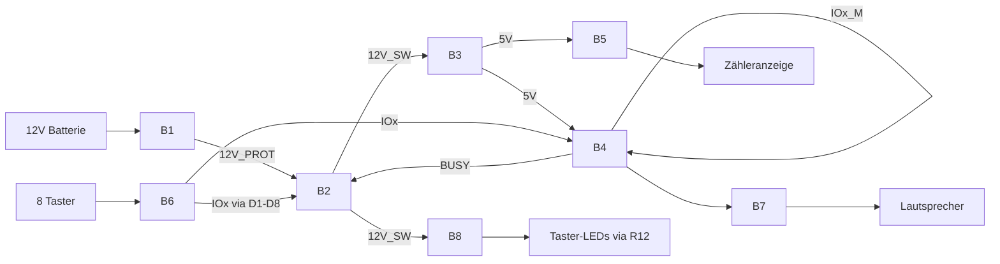

# Digitaler Zwilling — Vogelstimmenkasten Rev 2

**Stand:** 3. August 2026  
**Ebenen:** System → Block (B1–B8) → Bauteil  
**PCB:** `hardware/vogelstimmen_v2.4.kicad_pcb` (Respin F-01…F-05)

---

## 1. Systemebene



| Rail | Wann aktiv | Verbraucher |
|------|------------|-------------|
| BAT+ | immer (Batterie) | nur Q5 |
| 12V_PROT | bei richtiger Polung | Latch-Logik, TVS, C1 |
| 12V_SW | nur Latch AN | Buck, R4 |
| **12V_LED** | nur Latch AN | R12 → J6 → 8× Taster-LEDs |
| 5V | nur Latch AN | DY-SV17F, K07.90, D10 |
| GND | immer | alles |

**Ruhestrom Ziel:** Latch AUS → ≈0 µA (E-LATCH-01/02). Kein dauerhafter Widerstand 12 V→GND; Zeners nur Leckage.

---

## 2. Blockebene (Kurz)

| Block | Aufgabe | Kritische Bauteile |
|-------|---------|-------------------|
| B1 | Verpolung, Überstrom, Transient | Q5, D11, R6, R7, F1, D9, C1 |
| B2 | Ein/Aus, Hold, Release | Q1, D12, R1, R8, Q2, Q3, **R13, C4**, D1–D8, R2–R4 |
| B3 | 12V→5V | U1, L1, C2, C3, **R5=0R** |
| B4 | Audio | U2 DY-SV17F, **D15–D22** |
| B5 | Zählen | J5 K07.90, D10 |
| B6 | Taster | J3, J4 |
| B7 | Lautsprecher | J2 |
| B8 | LEDs | J6, **R12** |

---

## 3. Bauteilebene (einzeln)

### B1 — Eingangsschutz

#### Q5 — SI2301CDS (P-MOSFET)
| | |
|--|--|
| **Ref** | Q5 |
| **Funktion** | Verpolungsschutz High-Side |
| **VDS** | 20 V max — 12 V Betrieb OK |
| **VGS** | ±8 V max — **ohne Clamp unzulässig** (Gate→GND wäre −12 V) |
| **LCSC** | C10487 |
| **Paket** | SOT-23 |

#### D11 — BZX84C6V2 (Zener 6,2 V)
| | |
|--|--|
| **Ref** | D11 |
| **Funktion** | VGS-Clamp an Q5: begrenzt \|VGS\| auf ~6,2 V |
| **Polarität** | **Kathode → Q5.Source (BAT+)**, **Anode → Q5.Gate** |
| **LCSC** | C179522 (Suzhou Good-Ark), Bestand >1000, ~$0,03 |
| **JLCPCB** | auch C2832549 / C5155258 u. a. |
| **Paket** | SOT-23 |
| **Bestellbar** | **ja** |

#### R7 — 4,7 kΩ (Serie Gate Q5)
| | |
|--|--|
| **Ref** | R7 |
| **Funktion** | Strombegrenzung für D11 beim Einschalten (~1 mA) |
| **Lage** | zwischen Q5.Gate und R6 (R6 weiter nach GND) |
| **Paket** | 0402 |

#### R6 — 470 kΩ
| | |
|--|--|
| **Ref** | R6 |
| **Funktion** | Gate nach GND (Q5 einschalten bei korrekter Polung); Idle ≈12 µA |
| **Paket** | 0402 |

#### F1 — PTC 1 A / 24 V
| | |
|--|--|
| **Ref** | F1 |
| **LCSC** | C2760272 |
| **Hinweis** | Nicht C20800 (nur 6 V)! |

#### D9 — SMAJ15A (TVS)
| | |
|--|--|
| **Ref** | D9 |
| **Funktion** | Klemmt Spitzen auf ~24 V |
| **LCSC** | C113958 |
| **Hinweis** | Uni-TVS; Kathode an 12V_PROT |

#### C1 — 10 µF / 25 V
Puffer an 12V_PROT.

---

### B2 — Latch

#### Q1 — SI2301CDS
| | |
|--|--|
| **Ref** | Q1 |
| **Funktion** | Leistungsschalter 12V_PROT → 12V_SW |
| **VGS** | wie Q5 — **Clamp D12 Pflicht** |
| **LCSC** | C10487 |

#### D12 — BZX84C6V2
| | |
|--|--|
| **Ref** | D12 |
| **Funktion** | VGS-Clamp an Q1 |
| **Polarität** | **Kathode → Q1.Source (12V_PROT)**, **Anode → Q1.Gate** |
| **LCSC** | C179522 |
| **Bestellbar** | **ja** |

#### R8 — 4,7 kΩ
| | |
|--|--|
| **Ref** | R8 |
| **Funktion** | Serie zwischen Q2.Drain und Q1.Gate (Zenerstrom begrenzen) |
| **Paket** | 0402 |

#### R1 — 100 kΩ
Pull-up Q1.Gate → 12V_PROT (Default AUS).

#### Q2 — 2N7002
SET/Hold-Logik; Gate = LATCH_SET.

#### Q3 — 2N7002
BUSY (über **R13 100 kΩ + C4 4,7 µF** an **Q3_GATE**) HIGH → Latch lösen. RC-Blanking ~470 ms (F-03).

#### R13 / C4 — BUSY-Blanking (Respin F-03)
| | |
|--|--|
| **R13** | 100 kΩ: BUSY → Q3_GATE |
| **C4** | 4,7 µF/16 V: Q3_GATE → GND |
| **Zweck** | Q3-Gate-Anstieg verzögern (Kaltstart/BUSY-Race) |

#### R2, R3, R4
100k Pull-down Q2, 10k BUSY, 10k Selbsthaltung.

#### D1–D8 — 1N4148WS
Latch-OR: **K = IOx** (Kabel/J3), **A = BTN_OR**.

#### D15–D22 — 1N4148WS (Respin F-01)
Modul-Schutz: **A = IOx_M** (U2), **K = IOx** (Kabel). Blockiert 12-V-Rückspeisung ins Modul.

#### Q6 / R9–R11 / D13–D14 — Kaltstart (v2.4, ≈0 µA)
- R9: 12V_PROT → BTN_OR (10 kΩ); Idle: BTN_OR≈12 V, **kein Strom**
- Q6 SI2301 (P): Idle VGS=0 → **aus**; Taster → ein → SET
- R11 + D14: Gate-Serie + VGS-Clamp (wie Q1/Q5)
- R10 1 kΩ + D13: SET nur HIGH; begrenzt Konflikt mit Q3-Release
- Q3.Drain an **LATCH_SET** — Details: `docs/entscheidungen.md` E-LATCH-02

---

### B3 — Buck

| Ref | Bauteil | Rolle |
|-----|---------|-------|
| U1 | TPS62163DSGR | 12V_SW → 5 V fest, EN=12V_SW |
| L1 | 2,2 µH | SW → 5 V |
| C2 | 10 µF/25 V | VIN |
| C3 | 22 µF/10 V | VOUT |
| R5 | **0 Ω** | VOS → 5 V direkt (TI, F-02) |
| **C4** | **4,7 µF/16 V** | Q3_GATE → GND (F-03) |
| **R13** | **100 kΩ** | BUSY → Q3_GATE (F-03) |

---

### B4 — Audio

| Ref | Bauteil | Rolle |
|-----|---------|-------|
| U2 | DY-SV17F | Wiedergabe, BUSY, **IOx_M**, SPK |
| **D15–D22** | 1N4148WS | Serie IOx_M ↔ IOx |
| | 5 V an Pin 13 | nur bei Latch AN |
| | Strom @5 V | Idle **14 mA** (Messung); Betrieb **≤60 mA** (Spec); SPK extra; V33 max 80 mA |

---

### B5 — Zähler

| Ref | Bauteil | Rolle |
|-----|---------|-------|
| J5 | Kübler K07.90 | Anzeige oben, Spule an 5 V |
| D10 | 1N4148WS | Freilauf (K→5 V, A→GND) |

---

### B6–B8 — Schnittstellen

| Ref | Funktion |
|-----|----------|
| J1 | Batterie |
| J2 | Lautsprecher BTL |
| J3 / J4 | Taster IO / GND (MPT 0,5/8) |
| J1 / J2 / J6 | BAT / SPK / LED (MPT 0,5/2) |
| J6 | LED **12V_LED** via **R12 10 Ω** |
| TP1–TP5 | 12V_PROT, 5V, GND, BUSY, SPK+ |

---

## 4. VGS-Schutz — Warum Zeners

```
Source = 12V ●── P-FET ── Drain
             │
           Gate ── R_serie ──→ Pull-down nach GND
             │
           Zener 6,2V (K an Source, A an Gate)

Ohne Zener: VGS = −12 V  >  |8 V| Limit SI2301
Mit Zener:  VGS ≈ −6,2 V  → sicher
```

Lastspannungen bleiben **12 V / 5 V** — die Zeners begrenzen nur die Gate-Ansteuerung.

---

## 5. Traceability (neu)

| ID | Aussage | Bauteile |
|----|---------|----------|
| H07 | VGS-Schutz P-FETs | D11, D12, R7, R8 |
| SF-10 | Eingangsschutz | Q5, D11, R6, R7, F1, D9, C1 |
| SF-02 | Einschalten | Q1, D12, R1, R8, Q2, … |

---

## 6. Offene Punkte

1. ~~PCB v2.4 routen → DRC = 0~~ ✅
2. ~~Respin F-01…F-05~~ ✅ (02.08.2026; DRC/ERC/Parität OK)
3. ~~F-06…F-09 Restrisiko~~ ✅ dispositioniert (03.08.2026)
4. Proto optional: F-03 Oszi; F-04 LED-Strom; F-08 5 V unter Last
5. Gerber/`2.final/` **neu exportieren** aus Working-PCB
6. M04 Review → Bestellung
