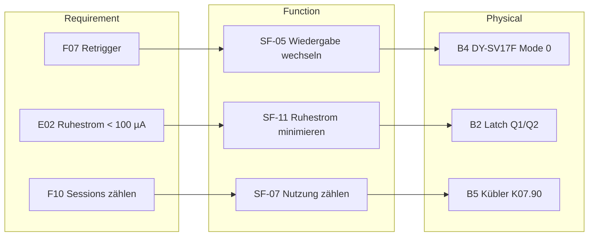

# Traceability-Matrix & Verifikationsplan

**Datum:** 29. Juli 2026
**Projekt:** Vogelstimmenkasten Rev 2

---

## 1. Direkte Traceability (R → P)

| Req-ID | Anforderung (Kurzform) | Block(s) | Schaltplan-Ref | Verifikation |
|--------|------------------------|----------|----------------|--------------|
| F01 | 8 Taster anschließbar | B6 | J3, J4 (2×8-pol) | V-INS |
| F02 | Feste Zuordnung Taster→Stimme | B4, B6 | IO1–IO8 → DY-SV17F | V-FUN |
| F03 | Wiedergabe < 500ms nach Druck | B2, B3, B4 | Latch + Buck + Boot | V-FUN |
| F04 | Tonsequenz ~10s | B4 | DY-SV17F Audio-Datei | V-FUN |
| F05 | Lautstärke 2–3m, 3W | B4, B7 | SPK+/SPK- (BTL) | V-FUN |
| F06 | Audio per USB austauschbar | B4 | Micro-USB am Modul | V-FUN |
| F07 | Retrigger: neue Stimme ersetzt alte | B4 | Mode 0 (Flanken-Trigger) | V-FUN |
| F08 | Keine gleichzeitige Wiedergabe | B4 | Mode 0 Eigenschaft | V-FUN |
| F09 | Mono-Lautsprecher | B7 | 1× SPK, BTL | V-INS |
| F10 | Impulszähler zählt Sessions | B5 | Kübler K07 an 5V | V-FUN |
| F11 | Taster-LEDs während Wiedergabe | B8 | 12V_SW → LEDs | V-FUN |
| E01 | Betrieb über 12V Batterie | B1, B3 | J1, TPS62163 | V-INS |
| E02 | Ruhestrom < 100 µA | B2 | Latch AUS → 0 µA | V-MES |
| E03 | Batterie ≥ 1 Jahr | B2 | Berechnung | V-ANA |
| E04 | Aufwachen per Taster | B2, B6 | Dioden-OR → Latch SET | V-FUN |
| E05 | Auto-Abschaltung nach Wiedergabe | B2, B4 | BUSY HIGH → Q3 → Latch AUS | V-FUN |
| E06 | Verstärker im Modul integriert | B4 | DY-SV17F intern | V-INS |
| U01 | -10°C bis +60°C | alle | Datenblatt-Prüfung | V-ANA |
| U02 | Feuchtigkeit tolerieren | — | Conformal Coating | V-INS |
| U03 | Wartungsfrei ≥ 1 Jahr | alle | Design-Review | V-REV |
| U04 | Keine beweglichen Teile | B4 | Flash intern, kein SD | V-INS |
| U05 | Kein Netzanschluss | B1 | Nur Batterie | V-INS |
| H01 | Printzähler 5V DC auf PCB | B5 | Kübler K07.90 (5V) | V-INS |
| H02 | SMD durch JLCPCB bestückt | alle SMD | BOM + CPL | V-REV |
| H03 | Manuell: THT + DY-SV17F + Zähler | B4, B5, B6 | THT MPT-Klemmen J1–J4,J6 | V-INS |
| H04 | 4× M3 Montagelöcher | PCB | Layout | V-INS |
| H05 | Testpunkte: 12V, 5V, GND, BUSY, Audio | PCB | TP1–TP5 | V-INS |
| H06 | Zähler von oben ablesbar (K07.90) | B5, PCB | Layout-Constraint | V-INS |
| H07 | VGS-Schutz SI2301 (Q5/Q1) per Zener 6,2 V | B1, B2 | D11, D12, R7, R8 | V-INS |
| M01 | BOM vorab bei LCSC verifiziert | — | `bom_verfuegbarkeit.md` | V-REV |
| M02 | Spannungsprüfung aller ICs | alle | Datenblatt vs. Schaltplan | V-REV |
| M03 | LTspice Simulation Stromversorgung | B3 | Simulation | V-SIM |
| M04 | Review-Checkliste vor Bestellung | — | Review-Dokument | V-REV |

---

## 1a. Funktionale Architektur (RFP-Kette)

MBSE-Referenzbeispiel: vollständige Kette **Requirement → Function → Physical**.

### Tabelle A: Systemfunktionen (F-Ebene)

| SF-ID | Systemfunktion | Beschreibung |
|-------|----------------|--------------|
| SF-01 | Benutzereingabe erfassen | Tastendruck erkennen und dem zugehörigen Kanal zuordnen |
| SF-02 | System einschalten | Latch aktivieren und Versorgung freigeben |
| SF-03 | Versorgungsspannung bereitstellen | 12 V auf 5 V wandeln für Modul und Zähler |
| SF-04 | Vogelstimme abspielen | Eine zugewiesene Audio-Datei wiedergeben |
| SF-05 | Wiedergabe wechseln | Laufende Stimme beenden und neue starten (Retrigger) |
| SF-06 | System automatisch abschalten | Nach Wiedergabe-Ende Latch lösen und stromlos werden |
| SF-07 | Nutzung zählen | Aufweck-/Wiedergabe-Session am Impulszähler erfassen |
| SF-08 | Betriebszustand anzeigen | Taster-LEDs während aktiver Wiedergabe beleuchten |
| SF-09 | Audiodateien verwalten | MP3/WAV per USB auf das Modul laden |
| SF-10 | Eingangsschutz gewährleisten | Verpolung und Überspannung am Batterieeingang abfangen |
| SF-11 | Ruhestrom minimieren | Im Idle den Verbraucherpfad vollständig trennen |
| SF-12 | Schallwandlung | Mono-Audio über Lautsprecher ausgeben |

### Tabelle B: R → F (Anforderung → Funktion)

| Req-ID | Anforderung | SF-ID(s) |
|--------|-------------|----------|
| F01 | 8 Taster anschließbar | SF-01 |
| F02 | Feste Zuordnung Taster→Stimme | SF-01, SF-04 |
| F03 | Wiedergabe < 500ms nach Druck | SF-02, SF-03, SF-04 |
| F04 | Tonsequenz ~10s | SF-04 |
| F05 | Lautstärke 2–3m, 3W | SF-04, SF-12 |
| F06 | Audio per USB austauschbar | SF-09 |
| F07 | Retrigger: neue Stimme ersetzt alte | SF-05 |
| F08 | Keine gleichzeitige Wiedergabe | SF-04, SF-05 |
| F09 | Mono-Lautsprecher | SF-12 |
| F10 | Impulszähler zählt Sessions | SF-07 |
| F11 | Taster-LEDs während Wiedergabe | SF-08 |
| E01 | Betrieb über 12V Batterie | SF-03, SF-10 |
| E02 | Ruhestrom < 100 µA | SF-11 |
| E03 | Batterie ≥ 1 Jahr | SF-11 |
| E04 | Aufwachen per Taster | SF-01, SF-02 |
| E05 | Auto-Abschaltung nach Wiedergabe | SF-06 |
| E06 | Verstärker im Modul integriert | SF-04, SF-12 |
| U01 | -10°C bis +60°C | SF-03, SF-04, SF-10, SF-11 |
| U02 | Feuchtigkeit tolerieren | SF-10 |
| U03 | Wartungsfrei ≥ 1 Jahr | SF-09, SF-11 |
| U04 | Keine beweglichen Teile | SF-04, SF-09 |
| U05 | Kein Netzanschluss | SF-03, SF-10 |
| H01 | Printzähler 5V DC auf PCB | SF-07 |
| H02 | SMD durch JLCPCB bestückt | SF-03, SF-10, SF-11 |
| H03 | Manuell: THT + DY-SV17F + Zähler | SF-01, SF-04, SF-07 |
| H04 | 4× M3 Montagelöcher | SF-07 |
| H05 | Testpunkte: 12V, 5V, GND, BUSY, Audio | SF-03, SF-04, SF-06 |
| H06 | Zähler von oben ablesbar (K07.90) | SF-07 |
| H07 | VGS-Schutz P-FETs (D11/D12) | SF-02, SF-10 |
| M01 | BOM vorab bei LCSC verifiziert | SF-03, SF-10, SF-11 |
| M02 | Spannungsprüfung aller ICs | SF-03, SF-10 |
| M03 | LTspice Simulation Stromversorgung | SF-03, SF-11 |
| M04 | Review-Checkliste vor Bestellung | SF-01–SF-12 |

### Tabelle C: F → P (Funktion → Physisch)

| SF-ID | Systemfunktion | Block(s) | Schlüsselkomponente |
|-------|----------------|----------|---------------------|
| SF-01 | Benutzereingabe erfassen | B6, B4 | J3/J4 → IOx → **D15–D22** → **IOx_M** → U2 |
| SF-02 | System einschalten | B2, B6 | D1–D8 → BTN_OR → Q6 → Latch SET |
| SF-03 | Versorgungsspannung bereitstellen | B1, B3 | TPS62163, L1, C2/C3 |
| SF-04 | Vogelstimme abspielen | B4 | DY-SV17F Mode 0 |
| SF-05 | Wiedergabe wechseln | B4 | DY-SV17F Flanken-Trigger |
| SF-06 | System automatisch abschalten | B2, B4 | BUSY → **R13/C4** → Q3 → Latch AUS |
| SF-07 | Nutzung zählen | B5 | Kübler K07.90 an 5V |
| SF-08 | Betriebszustand anzeigen | B8 | 12V_SW → **R12** → 12V_LED → J6 |
| SF-09 | Audiodateien verwalten | B4 | Micro-USB am DY-SV17F |
| SF-10 | Eingangsschutz gewährleisten | B1 | Q5, D11, R6/R7, SMAJ15A, PTC |
| SF-11 | Ruhestrom minimieren | B2 | Q1/Q2 Latch (0 µA Idle) |
| SF-12 | Schallwandlung | B4, B7 | SPK+/SPK− (BTL) |

### Exemplarische RFP-Ketten (Mermaid)

### Legende Verifikationsmethoden

| Kürzel | Methode | Beschreibung |
|--------|---------|--------------|
| V-FUN | Funktionstest | Praktischer Test am aufgebauten Prototyp |
| V-MES | Messung | Messwert mit Multimeter/Oszilloskop erfassen |
| V-INS | Inspektion | Visuelle Prüfung / Augenscheinnahme |
| V-ANA | Analyse | Rechnerischer Nachweis / Datenblatt-Vergleich |
| V-REV | Review | Dokumentenprüfung / Checkliste |
| V-SIM | Simulation | LTspice / Digitaler Zwilling |

---

## 2. Verifikationsplan

### Phase 1: Design-Verifikation (vor Fertigung)

| # | Prüfpunkt | Methode | Referenz | Status |
|---|-----------|---------|----------|--------|
| D01 | Alle IC-Spannungen vs. Datenblatt-Max | V-REV | M02 | ✅ erledigt |
| D02 | BOM bei LCSC verfügbar + korrekte Footprints | V-REV | M01, `bom_verfuegbarkeit.md` | ✅ erledigt |
| D03 | Systemarchitektur dokumentiert (BDD/IBD) | V-REV | `systemarchitektur.md` | ✅ erledigt |
| D04 | Schaltplan-Dokumentation vollständig | V-REV | `schaltplan.md` | ✅ erledigt |
| D05 | Digitaler Zwilling: Logikfluss korrekt | V-SIM | Canvas Simulation | ✅ erledigt |
| D06 | LTspice: Buck-Converter Ripple < 50mV | V-SIM | M03 | ⏳ offen |
| D07 | LTspice: Latch-Schaltung funktional | V-SIM | M03 | ⏳ offen |
| D08 | KiCad ERC = 0 Fehler | V-REV | KiCad | ✅ erledigt (`ERC_v2_check.rpt`; 1 Warnung SET_DRV) |
| D09 | KiCad DRC = 0 Fehler | V-REV | KiCad | ✅ erledigt (`DRC_v2.4_check.rpt`; 1 Footprint-Warnung U2) |
| D10 | Review-Checkliste komplett | V-REV | M04 | ⏳ Vorlage bereit (`review_checkliste_m04.md`) — Signatur offen |

### Phase 2: Aufbau-Verifikation (nach Bestückung)

| # | Prüfpunkt | Methode | Req-IDs | Akzeptanzkriterium |
|---|-----------|---------|---------|-------------------|
| A01 | Visuelle Inspektion Lötqualität | V-INS | H02, H03 | Keine Brücken, alle Teile korrekt |
| A02 | Kurzschlusstest vor Einschalten | V-MES | — | >1 MΩ zwischen 12V und GND |
| A03 | 12V anlegen, 5V messen | V-MES | E01 | 4,9V – 5,1V an TP_5V |
| A04 | Ruhestrom messen (kein Taster) | V-MES | E02 | < 100 µA (Ziel: 0 µA) |
| A05 | Verpolungsschutz testen | V-MES | — | Kein Strom bei falscher Polung |

### Phase 3: Funktionstest (am Prototyp)

| # | Prüfpunkt | Methode | Req-IDs | Akzeptanzkriterium |
|---|-----------|---------|---------|-------------------|
| T01 | Taster 1–8 einzeln drücken | V-FUN | F01, F02 | Jeder spielt korrekte Stimme |
| T02 | Wiedergabe-Latenz messen | V-MES | F03 | < 500ms (Oszilloskop: Taster-Flanke → Audio-Ausgang) |
| T03 | Sound-Dauer prüfen | V-FUN | F04 | ~10s pro Stimme |
| T04 | Lautstärke in 2m Abstand | V-FUN | F05 | Gut wahrnehmbar |
| T05 | Retrigger: Taster während Wiedergabe | V-FUN | F07 | Alte Stimme stoppt, neue startet |
| T06 | Keine Doppelwiedergabe | V-FUN | F08 | Nur 1 Stimme gleichzeitig |
| T07 | Zähler inkrementiert bei Aufweck-Event | V-FUN | F10 | +1 pro Latch-AN |
| T08 | LEDs leuchten während Wiedergabe | V-FUN | F11 | Alle 8 LEDs an |
| T09 | Auto-Abschaltung nach Sound-Ende | V-FUN | E05 | System geht in Idle (0 µA) |
| T10 | USB Audio-Upload | V-FUN | F06 | PC erkennt USB-Stick, Dateien kopierbar |
| T11 | 1000-Zyklen Dauertest | V-FUN | — | Kein Fehler nach 1000 Betätigungen |

### Phase 4: Umwelt-Verifikation (optional)

| # | Prüfpunkt | Methode | Req-IDs | Akzeptanzkriterium |
|---|-----------|---------|---------|-------------------|
| U01 | Kältetest -10°C | V-FUN | U01 | Funktion OK |
| U02 | Hitzetest +60°C | V-FUN | U01 | Funktion OK |
| U03 | Feuchtigkeitstest (Betauung) | V-FUN | U02 | Kein Ausfall |

---

## 3. Batterie-Lebensdauer (Analyse V-ANA für E03)

**Batterie:** herkömmliche 12 V-Autobatterie (Blei), ~30 Ah.  
**Elektronik-Idle:** ~12 µA (R6 Verpolungsschutz); Latch/Buck/Modul aus — für Jahresbilanz vernachlässigbar (~0,1 mAh/a).

### Real case (Basis für E03 ≥ 1 Jahr) — Stand 01.08.2026

| Annahme | Wert |
|---------|------|
| Selbstentladung | ~1,5 %/Monat (gesunde Batterie, gemäßigte Temperatur) |
| Nutzung | ~10×/Tag × ~15 s |
| Aktivstrom Mittel | ~250 mA |
| Nutzbare Kapazität | 50 % DoD → 15 Ah |

- Aktiv/Tag: 10 × 15 s × 250 mA ≈ **10 mAh/Tag**
- Selbstentladung/Tag: 30 000 × 1,5 % / 30 ≈ **15 mAh/Tag**
- Summe ≈ **25 mAh/Tag** → 15 000 / 25 ≈ **600 Tage ≈ 1,5–2 Jahre**
- Mit Puffer (Wetter/Alter): **ca. 1 Jahr+** → **E03 Real case erfüllt**

### Konservativ / Worst case (nur zur Einordnung)

Selbstentladung 3 %/Monat, 20 Plays/Tag, 300 mA → ~55 mAh/Tag → **~9 Monate**.  
Nicht die Planungsbasis; zeigt Sensitivität auf Hitze/hohe Nutzung.

---

## 4. Zusammenfassung

| Kategorie | Gesamt | Erledigt | Offen |
|-----------|--------|----------|-------|
| Design-Verifikation (D01–D10) | 10 | 6 | 4 |
| Aufbau-Verifikation (A01–A05) | 5 | 0 | 5 |
| Funktionstest (T01–T11) | 11 | 0 | 11 |
| Umwelttest (U01–U03) | 3 | 0 | 3 |
| **Gesamt** | **29** | **6** | **23** |
